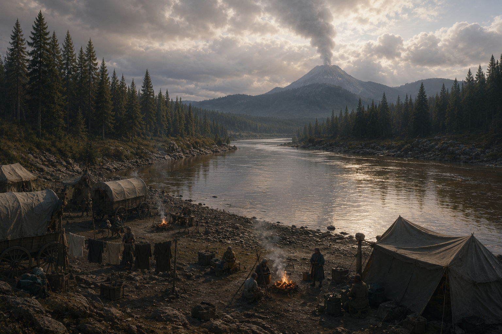

# El Vado del Río Frío y las Ruinas Submarinas

## Lo que el party sabe
Cruce de río a dos días de Neverwinter por el Camino Alto. Un temblor
menor dejó al descubierto una entrada bajo el agua hacia una cámara
sumergida antigua. Ahí encontramos un cristal con magia muy vieja,
custodiado por Chuul que parecían cumplir una función específica más
que atacar por hambre — sospechamos que protegían algo, aunque no
sabemos bien qué.

## NPCs que conocieron ahí
- [[../npcs/mira-holt]] — nos encargó despejar el vado.
- [[../npcs/tobias-renn]] — barquero que nos prestó su bote.

## Visitas
- [[../sesiones/sesion-08|OS08]] — combate contra Chuul, recuperamos
  el cristal y una perla del río.

