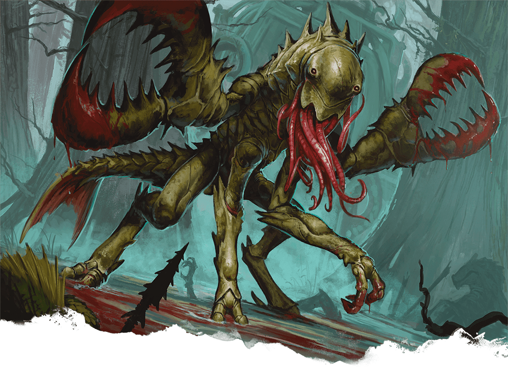

# Chuul (notas del party)

## Notas de campo
- Caparazón grueso y correoso — cuesta herirlos con armas comunes.
- Se mueven igual de bien en tierra que bajo el agua.
- Sus tenazas son lo bastante fuertes como para inmovilizar a quien
  agarran.
- Cerca de la boca tienen una especie de tentáculos que paralizan con
  solo tocarlos — ese es el verdadero peligro, no las tenazas.
- No se comportan como bestias hambrientas — parecían cumplir una tarea
  puntual, más guardianes que depredadores. Todavía no sabemos bien qué
  protegían.

## Dónde lo enfrentaron
- [[../sesiones/sesion-08|OS08]] — en la orilla y dentro de las
  ruinas submarinas de El Vado.
