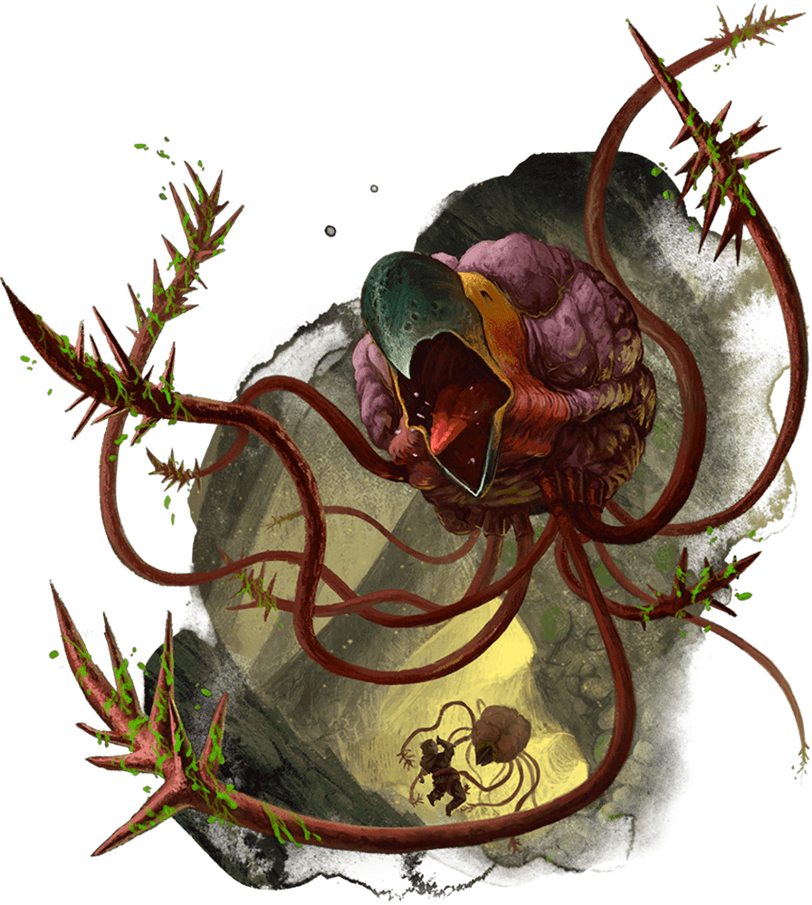

# Grell

## Notas de campo
- Criatura alargada y flotante, con tentáculos alrededor de una boca
  circular.
- Apareció dentro del espacio psíquico del cristal, en el segundo
  intento de sintonización de Thaldeera.
- Mucho más agresiva que el Nothic del primer intento — atacó casi de
  inmediato.
- Le arrebató vitalidad a Thaldeera dentro de ese espacio; ella despertó
  de golpe con un fuerte dolor de cabeza.
- La identificamos consultando la *Guía de Monstruos de Volo* después
  del encuentro.

## Dónde lo enfrentaron
- [[../sesiones/sesion-09|OS09]] — dentro del espacio psíquico del
  cristal, durante el segundo intento de sintonización de Thaldeera.
