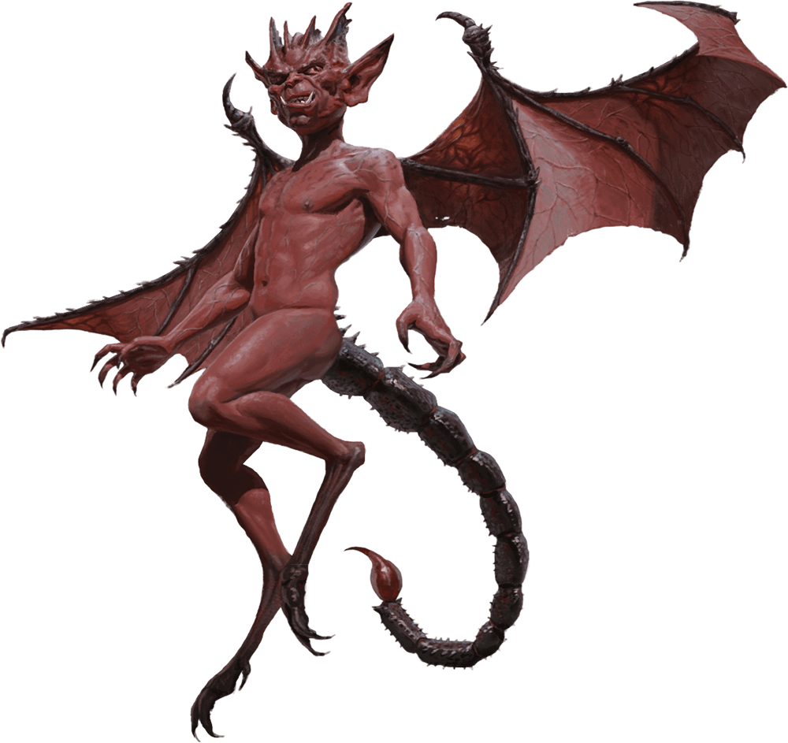

# Imp

## Notas de campo
- Diablillo diminuto, alado, con una picadura sorprendentemente venenosa
  para su tamaño.
- Puede volverse invisible a voluntad — el verdadero peligro es no verlo
  venir.
- Cambia de forma: lo vimos parecer una rata, un cuervo y hasta una araña
  antes de mostrar su forma verdadera.
- Servía al Culto de Asmodeus durante el ritual interrumpido — probable
  espía o refuerzo convocado por ellos, no un actor independiente.

## Dónde lo enfrentaron
- [[../sesiones/sesion-06|OS06]] — en el templo secreto del sótano de la
  casa "abandonada" del distrito del mercado.
