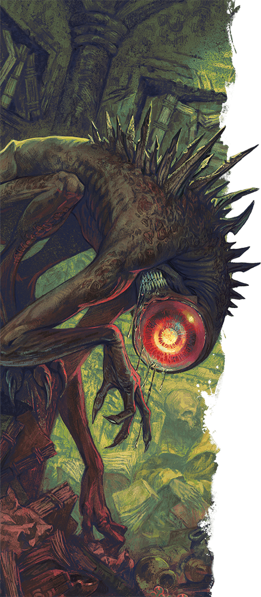

# Nothic (notas del party)

## Notas de campo
- No lo vimos en el mundo físico — apareció dentro del espacio psíquico
  blanco que genera el cristal de El Vado al tocarlo.
- Atacó casi de inmediato apenas Corvin y Rami entraron en el trance del
  cristal.
- Rami y Corvin lo destruyeron juntos y salieron del trance de
  inmediato — parece ser una defensa del cristal, no una criatura
  suelta.
- Lo identificamos con ayuda de la *Guía de Monstruos de Volo*.
- En el segundo intento de sintonización (Thaldeera), la defensa fue
  distinta y más agresiva: un [[grell]].

## Dónde lo enfrentaron
- [[../sesiones/sesion-09|OS09]] — dentro del espacio psíquico del
  cristal, durante el primer trance de Corvin.
