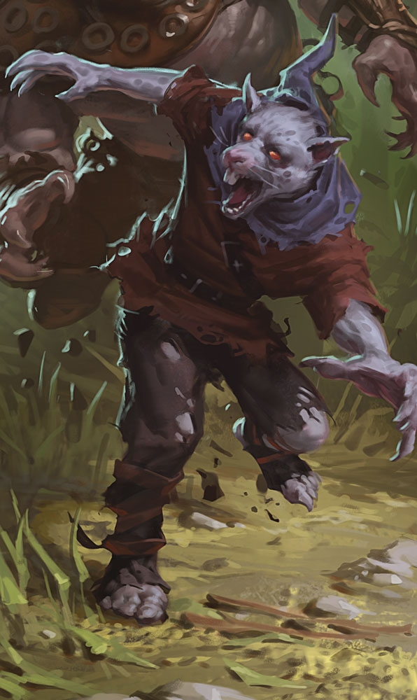

# Wererat

## Notas de campo
- Cambiaformas: los vimos pasar de humanoide a una forma híbrida
  rata-humanoide, y hasta a rata pequeña.
- Ágiles y sigilosos, cómodos trepando paredes tanto como corriendo por
  las alcantarillas.
- Pelean con ballesta de mano a distancia y garras/mordida de cerca — la
  mordida, si no se trata, puede contagiar la licantropía.
- Una banda de ladrones wererat operaba desde las alcantarillas del
  puerto bajo el mando de Silas Shadowbane.

## Dónde lo enfrentaron
- [[../sesiones/sesion-07|OS07]] — en la guarida de Silas Shadowbane, en
  las alcantarillas del puerto. Silas murió esa noche (ver
  [[../npcs/silas-shadowbane]]), pero varios de su banda escaparon en el
  caos — siguen sueltos en algún lugar de la ciudad.
